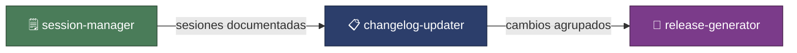

# 📝 doc-work-skill

### Cadena de documentación automatizada para proyectos asistidos por IA.

---

## Tabla de contenidos

- [🎯 Propósito](#-propósito)
- [🔄 Flujo de trabajo](#-flujo-de-trabajo)
- [⚙️ Skills](#️-skills)
- [📦 Instalación](#-instalación)
- [📚 Documentación adicional](#-documentación-adicional)
- [📄 Licencia](#-licencia)

---

## 🎯 Propósito

Colección de 3 skills integrados que forman una cadena de documentación automatizada para proyectos asistidos por IA. Cubren desde el registro de sesiones de trabajo hasta la generación de release notes, garantizando **trazabilidad completa** del proceso de desarrollo.

---

## 🔄 Flujo de trabajo

| Paso | Skill | Acción | Salida |
|:----:|:------|:-------|:-------|
| 1 | `session-manager` | Registra trabajo y decisiones de cada sesión IA. | `changelog-sessions.md` |
| 2 | `changelog-updater` | Actualiza la sección `[Unreleased]` del CHANGELOG. | `CHANGELOG.md` |
| 3 | `release-generator` | Cierra versión, genera release notes y archiva sesiones. | Release Notes + histórico |

> [!NOTE]
> Los tres skills están diseñados para funcionar en conjunto como cadena, pero cada uno puede usarse de forma independiente si solo se necesita una parte del flujo.

---

## ⚙️ Skills

### 1. `session-manager`

Documenta automáticamente el trabajo de sesiones IA preservando contexto, decisiones técnicas y trazabilidad completa ante compactaciones de memoria.

<strong>🔑 Qué hace</strong>

- Registra el trabajo realizado en cada sesión de IA.
- Preserva el contexto y las decisiones técnicas tomadas.
- Mantiene trazabilidad incluso cuando la memoria del agente se compacta.
- Genera entradas estructuradas en `changelog-sessions.md`.

> Ver documentación completa: [session-manager/README.md](skills/session-manager/README.md)

---

### 2. `changelog-updater`

Mantiene la sección `[Unreleased]` del `CHANGELOG.md` actualizada automáticamente, agrupando cambios por sesión de trabajo.

<strong>🔑 Qué hace</strong>

- Consume las sesiones documentadas por `session-manager`.
- Agrupa los cambios por sesión en la sección `[Unreleased]`.
- Mantiene el formato estándar de CHANGELOG.

> Ver documentación completa: [changelog-updater/README.md](skills/changelog-updater/README.md)

---

### 3. `release-generator`

Automatiza el cierre completo de versiones generando release notes detalladas, actualizando `CHANGELOG.md` y preservando el histórico de sesiones.

<strong>🔑 Qué hace</strong>

- Cierra la versión actual y genera release notes.
- Actualiza `CHANGELOG.md` con la nueva versión.
- Archiva las sesiones procesadas en `changelog-sessions.md`.

> Ver documentación completa: [release-generator/README.md](skills/release-generator/README.md)

---

## 📦 Instalación

1. Clonar o copiar las carpetas de los skills que se necesiten al directorio de skills del proyecto destino.
2. Registrar los skills en el archivo `AGENTS.md` del proyecto, en la tabla de skills disponibles.
3. Configurar los archivos de documentación base (`CHANGELOG.md`, `changelog-sessions.md`) según las instrucciones de cada skill.

> [!TIP]
> Si solo necesitas una parte del flujo, puedes instalar skills individuales. No es obligatorio usar los tres.

---

## 📄 Licencia

MIT License

---

> **Creado por:** Adrián (IPGSoft) · **Última actualización:** 2026-03-21