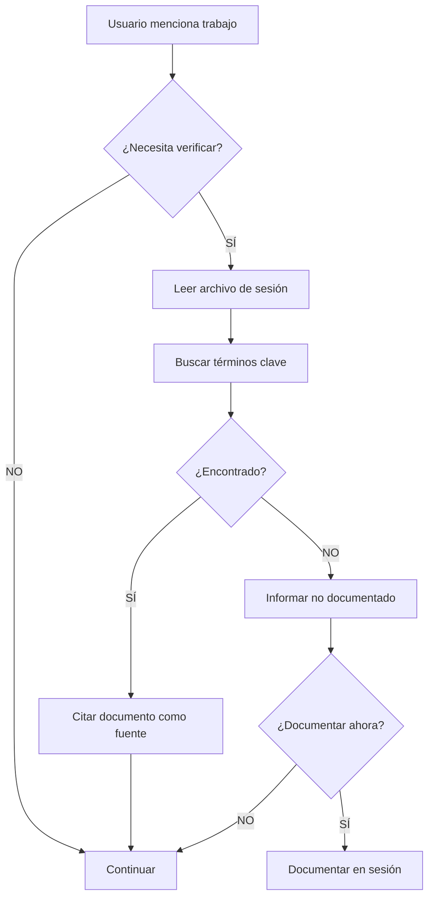

# Principio de Fuente de Verdad Única

## Concepto Core

**El documento de sesión es la ÚNICA fuente de verdad autorizada sobre:**
- Qué trabajo se ha realizado
- Qué decisiones se han tomado
- Por qué se tomaron esas decisiones
- Cuándo se hizo cada cosa

**El contexto conversacional:**
- Es volátil (se compacta, se pierde)
- Puede estar desactualizado
- Puede contener información incorrecta
- NO debe ser la única referencia

## Regla de Oro

> **En caso de contradicción entre el contexto conversacional y el documento de sesión, el documento de sesión SIEMPRE tiene prioridad absoluta.**

## Procedimiento Obligatorio

### ANTES de documentar CUALQUIER cosa:

```
1. Leer físicamente el archivo de sesión actual
   ↓
2. Buscar si la información ya existe
   ↓
3. Decidir acción basándose en el archivo (NO en memoria)
   ↓
4. Ejecutar acción
```

**NUNCA:**
```
❌ "Recuerdo que documenté X" → Documentar
❌ "En nuestra conversación hablamos de Y" → Asumir documentado
❌ "El usuario mencionó Z antes" → Confiar sin verificar
```

**SIEMPRE:**
```
✅ Leer doc/agents-sessions/YYYYMMDD-XXX-CLAUDE.md
✅ Buscar términos clave en el archivo
✅ Basar decisión en contenido real del archivo
```

## Casos de Uso

### Caso 1: Verificar si Algo Está Documentado

**Usuario:** "Documenté la implementación de JWT ayer"

**❌ INCORRECTO:**
```
Agente: "Sí, recuerdo que hablamos de JWT"
        [asume basándose en contexto]
        [NO verifica archivo]
```

**✅ CORRECTO:**
```
Agente: [lee doc/agents-sessions/20260209-001-CLAUDE.md]
        [busca: "JWT", "login", "autenticación"]
        
        SI encuentra → "Sí, está documentado en sección 14:23"
        SI NO encuentra → "No veo JWT documentado en la sesión actual.
                           ¿Quieres que lo documente ahora?"
```

### Caso 2: Responder Preguntas sobre Decisiones

**Usuario:** "¿Por qué elegimos Redis para sessions?"

**❌ INCORRECTO:**
```
Agente: "Creo que por rendimiento y escalabilidad"
        [responde desde memoria conversacional]
```

**✅ CORRECTO:**
```
Agente: [lee archivo de sesión]
        [busca: "Redis", "sessions", "decisión"]
        
        SI encuentra decisión documentada:
        "Según la sesión del 9 de febrero, elegimos Redis por:
        - Latencia sub-1ms para reads
        - TTL automático para expiración de sesiones
        - Soporte clustering para alta disponibilidad"
        
        SI NO encuentra:
        "No encuentro esa decisión documentada en las sesiones.
        ¿Fue antes de que empezáramos a documentar?"
```

### Caso 3: Evitar Duplicación

**Usuario:** "Implementé rate limiting en el login"

**❌ INCORRECTO:**
```
Agente: "No recuerdo que hayamos hablado de rate limiting"
        [documenta basándose solo en memoria]
        [PUEDE DUPLICAR si ya está documentado]
```

**✅ CORRECTO:**
```
Agente: [lee archivo de sesión]
        [busca: "rate limiting", "login", "límite"]
        
        SI encuentra → "Rate limiting ya documentado en sección 14:23"
        SI NO encuentra → [documenta nuevo trabajo]
```

## Por Qué el Contexto Conversacional No Es Confiable

### 1. Compactación de Contexto
```
Situación: Conversación larga → Claude compacta contexto
Resultado: Información detallada se pierde
Ejemplo: "Implementamos JWT" → Queda
         Reasoning detallado → Se pierde
```

### 2. Sesiones Múltiples
```
Situación: Usuario inicia nueva conversación
Resultado: Contexto anterior no disponible
Ejemplo: Sesión de ayer → No accesible hoy
         Documento de ayer → Sí accesible
```

### 3. Información Incorrecta
```
Situación: Usuario recuerda mal
Resultado: Contexto tiene info errónea
Ejemplo: Usuario: "Usamos MySQL"
         Documento: "PostgreSQL"
         Verdad: PostgreSQL (documento correcto)
```

### 4. Ambigüedad Temporal
```
Situación: "Implementamos X"
Pregunta: ¿Cuándo? ¿En esta sesión o hace meses?
Contexto: No tiene timestamp preciso
Documento: Timestamp exacto: "14:23 - 9 de febrero de 2026"
```

## Workflow de Verificación



## Comandos de Verificación

El agente debe usar herramientas para leer físicamente:

```bash
# Leer archivo completo
cat doc/agents-sessions/20260209-001-CLAUDE.md

# Buscar términos específicos
grep -i "jwt\|login\|auth" doc/agents-sessions/20260209-001-CLAUDE.md

# Ver última actualización
head -7 doc/agents-sessions/20260209-001-CLAUDE.md | grep "Hora de últimos"
```

## Excepciones

**Única excepción donde el contexto conversacional es válido:**

```
Trabajo ACABADO DE HACER en esta conversación Y
aún no documentado
```

**Ejemplo:**
```
Agente: [acaba de implementar login]
        [aún no ha documentado]
Usuario: "¿Funcionó el login?"
Agente: "Sí, acabo de implementarlo y está funcionando"
        [OK usar contexto inmediato]
        [Pero LUEGO documentar proactivamente]
```

**En todos los demás casos: VERIFICAR DOCUMENTO PRIMERO**

## Resumen Ejecutivo

### Cuando el Usuario Pregunta/Menciona Algo:

1. ✅ **Leer archivo de sesión**
2. ✅ **Buscar información en archivo**
3. ✅ **Basar respuesta en archivo**
4. ❌ **NO confiar solo en memoria conversacional**

### Cuando Necesites Documentar:

1. ✅ **Leer archivo de sesión primero**
2. ✅ **Verificar si ya existe**
3. ✅ **Decidir basándote en contenido real**
4. ❌ **NO asumir basándote en conversación**

**Mantra:** *"Documento primero, memoria después"*
